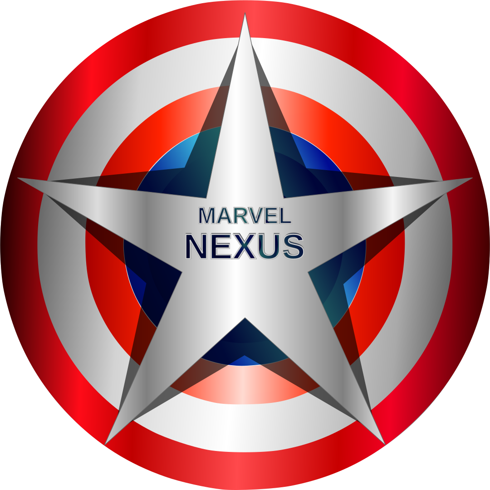

<div align="center">
  
  <h1>Marvel NEXUS</h1>
  <p>🌌 Explore o universo Marvel com um portal interativo de HQs, personagens e lançamentos 🌟</p>
</div>

---

## 🔍 Sobre o Projeto

**Marvel NEXUS** é uma aplicação web desenvolvida com foco em consumir a [API oficial da Marvel](https://developer.marvel.com/), exibindo dados de quadrinhos, heróis e lançamentos de maneira elegante, interativa e responsiva.

> Este projeto foi idealizado como parte do meu portfólio pessoal com o objetivo de demonstrar domínio em tecnologias modernas de frontend, consumo de APIs REST e design responsivo.

---

## 🚀 Tecnologias Utilizadas

<div align="left">
  
  
  
  
  
  
</div>

- **ReactJS + TypeScript**
- **Sass (SCSS)**
- **Vite** para bundling rápido
- **Consumo da API da Marvel**
- **Font Awesome e React Icons** para ícones
- **Responsividade Mobile First**
- **Componentização, organização modular e boas práticas de código**

---

## 📸 Funcionalidades

- 🔍 Buscar quadrinhos por mês e ano (com validação e formatação automática)
- 🦸 Listagem de personagens e heróis mais populares
- 📆 Calendário de lançamentos por data
- 📖 Leitor de quadrinhos com controle deslizante e animações suaves
- 🎨 Interface moderna com design adaptável para todas as resoluções

---

## 📱 Layout Responsivo

Desenvolvido com _media queries_ específicas para dispositivos com larguras de `840px`, `768px` e `430px`, garantindo uma excelente experiência tanto em **desktop** quanto em **dispositivos móveis**.

---

## 🔗 Acesse o Projeto

- 🌐 **Deploy:** [nexusmarvel.netlify.app](https://nexusmarvel.netlify.app/)
- 🗂️ **Repositório:** [github.com/BMinority/nexus-marvel](https://github.com/BMinority/nexus-marvel)

- 📥 **Clone o projeto localmente:**

```bash

git clone https://github.com/BMinority/nexus-marvel.git

```

## 👨‍💻 Desenvolvido por

### Bruno Coelho

🎯 Desenvolvedor Full Stack com foco em tecnologias modernas do ecossistema JavaScript.

📁 Portfólio: [Bruno Coelho](https://brunocoelhodd.vercel.app/)

## 📄 Licença

Este projeto é de código aberto e está sob a licença MIT.
